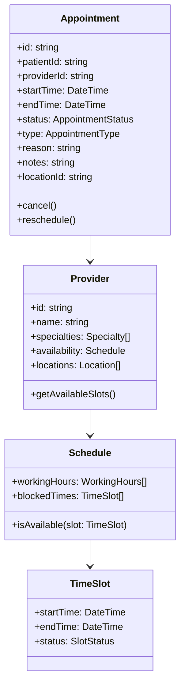
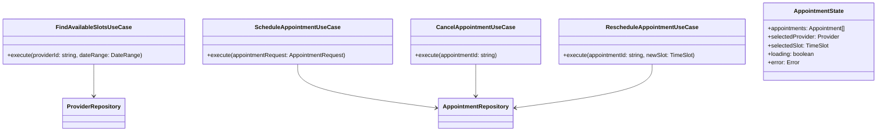
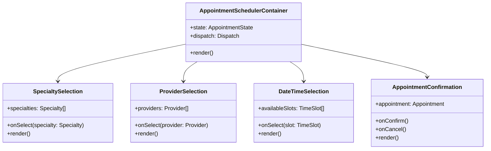

# Appointments Feature Architecture

This document outlines the clean architecture design for the Premier Healthcare Platform's appointments feature, focusing on domain entities, use cases, and interface components.

## Domain Layer

### Core Entities and Interfaces



### Domain Interfaces

```typescript
interface AppointmentRepository {
  findById(id: string): Promise<Appointment>
  findByPatient(patientId: string): Promise<Appointment[]>
  findByProvider(providerId: string): Promise<Appointment[]>
  save(appointment: Appointment): Promise<void>
  delete(id: string): Promise<void>
}

interface ProviderRepository {
  findById(id: string): Promise<Provider>
  findBySpecialty(specialtyId: string): Promise<Provider[]>
  findAvailableSlots(providerId: string, dateRange: DateRange): Promise<TimeSlot[]>
}
```

## Application Layer

### Use Cases and State Management



### State Management Pattern

```typescript
// Appointment Actions
type AppointmentAction = 
  | { type: 'SELECT_PROVIDER'; provider: Provider }
  | { type: 'SELECT_SLOT'; slot: TimeSlot }
  | { type: 'SCHEDULE_APPOINTMENT'; appointment: Appointment }
  | { type: 'SET_LOADING'; loading: boolean }
  | { type: 'SET_ERROR'; error: Error }

// Appointment Context Provider
interface AppointmentContextValue {
  state: AppointmentState;
  dispatch: Dispatch<AppointmentAction>;
  findAvailableSlots: (providerId: string, dateRange: DateRange) => Promise<void>;
  scheduleAppointment: (request: AppointmentRequest) => Promise<void>;
  cancelAppointment: (appointmentId: string) => Promise<void>;
}
```

## Interface Layer

### Component Hierarchy



### Component Interfaces

```typescript
// Clean component structure
interface AppointmentSchedulerProps {
  onAppointmentScheduled: (appointment: Appointment) => void;
  onCancel: () => void;
}

interface ProviderSelectionProps {
  providers: Provider[];
  selectedProvider?: Provider;
  onSelect: (provider: Provider) => void;
}

interface DateTimeSelectionProps {
  availableSlots: TimeSlot[];
  selectedSlot?: TimeSlot;
  onSelect: (slot: TimeSlot) => void;
}
```

### External Service Adapters

```typescript
interface AppointmentApiService {
  getAvailableSlots(providerId: string, dateRange: DateRange): Promise<TimeSlot[]>;
  scheduleAppointment(request: AppointmentRequest): Promise<Appointment>;
  cancelAppointment(appointmentId: string): Promise<void>;
}

interface NotificationService {
  sendAppointmentConfirmation(appointment: Appointment): Promise<void>;
  sendReminder(appointment: Appointment): Promise<void>;
}
```

## Implementation Benefits

1. **SOLID Principles**
   - Clear separation of concerns
   - Single responsibility for each component
   - Interfaces for dependency inversion

2. **Clean Architecture**
   - Domain entities isolated from external concerns
   - Business logic encapsulated in use cases
   - UI components independent of business logic

3. **Maintainability**
   - Well-structured component hierarchy
   - Clear data flow through the application
   - Isolated external service dependencies

4. **Testability**
   - Domain logic can be tested independently
   - Use cases can be tested with mock repositories
   - UI components can be tested in isolation

5. **Scalability**
   - New features can be added without modifying existing code
   - External services can be changed with minimal impact
   - State management pattern supports complex workflows